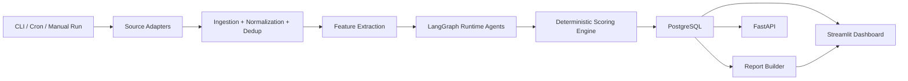

# Architecture Baseline

## System overview

The project should start as a Python modular monolith with three surfaces:

- CLI-first operations entrypoint for weekly runs and admin tasks
- FastAPI API for read and control endpoints
- Streamlit dashboard for read-only ranking and report exploration

The weekly analysis pipeline is the only agentic part of the system. Ingestion, normalization, deduplication, scoring math, persistence, and report rendering stay deterministic and directly testable.

## Architecture goals

- Keep MVP delivery fast and operationally simple
- Allow weekly reruns with full history and explainability
- Keep external source coupling optional through adapters
- Separate AI judgment from deterministic business logic
- Support local-first development with CSV, JSON, and mock inputs

## High-level flow



## Core components

### Runtime surfaces

- `bin/radar.py`: main CLI for ingest, pipeline execution, reports, and ops tasks
- `apps/api`: FastAPI app for health, jobs, products, rankings, and reports
- `apps/dashboard`: Streamlit app for read-only analysis of weekly rankings

### Domain services

- `services/ingestion`: CSV, JSON, mock adapters plus normalization and dedup rules
- `services/workers`: deterministic background steps such as ingestion, feature extraction, and report assembly
- `services/orchestration`: LangGraph state, graph definitions, and run coordination
- `services/agents`: runtime prompts, contracts, and wrappers for AI agents
- `services/scoring`: weighted scoring, heuristics, classification, and explainability
- `services/reporting`: weekly report generation and export shaping
- `services/shared`: config, db session management, logging, and shared schemas

### Persistence

PostgreSQL is the source of truth for:

- raw snapshots and ingestion lineage
- canonical products and aliases
- extracted signals and agent evidence
- weekly scores and classifications
- generated reports and pipeline runs

## Recommended repository structure

```text
bin/
  radar.py
apps/
  api/
  dashboard/
services/
  orchestration/
    graphs/
    state/
  ingestion/
    adapters/
    normalization/
  workers/
  agents/
    contracts/
    prompts/
    runtime/
  scoring/
    policies/
    explainability/
  reporting/
  shared/
    config/
    db/
    logging/
infra/
  docker/
  migrations/
docs/
tests/
  unit/
  integration/
  smoke/
scripts/
  seed/
  ops/
```

## Key design decisions

1. Use a modular monolith instead of microservices. The MVP needs shared transactions, low ops overhead, and fast iteration.
2. Make the CLI the primary control plane. The weekly radar must run without depending on the dashboard.
3. Use adapters for every data source. CSV, JSON, and mock inputs are required before real connectors.
4. Keep AI agents scoped to signal interpretation. Final score math, heuristics, and evidence persistence stay deterministic.
5. Persist raw, normalized, and derived layers. This is required for reruns, auditability, and troubleshooting.
6. Keep human review in the weekly publication loop. The system can produce a draft ranking, but calibration and QA approve publication.

## MVP boundary

### MVP

- CSV import, JSON snapshots, and mock connectors
- LangGraph pipeline with 3 runtime agents
- Deterministic saturation and revenue heuristics
- PostgreSQL persistence with run history
- FastAPI + Streamlit + CLI
- Weekly ranking and simple report output

### Post-MVP

- real platform connectors
- dedicated saturation, commission, and content-angle agents
- queueing and stronger retry infrastructure
- admin controls for weight tuning
- richer exports, notifications, and scheduling
- multi-tenant access control
